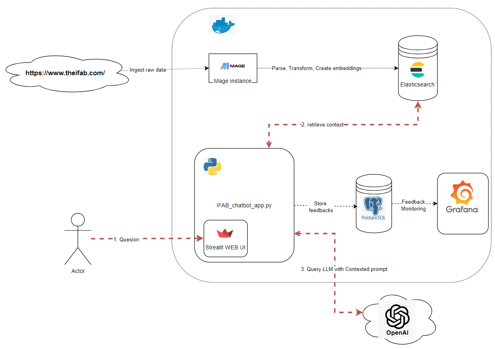
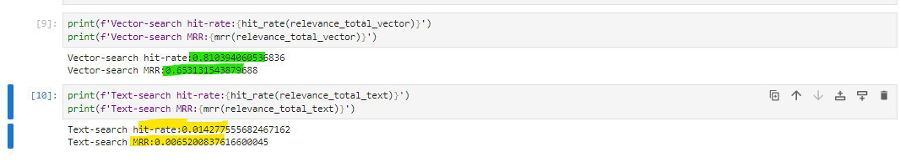
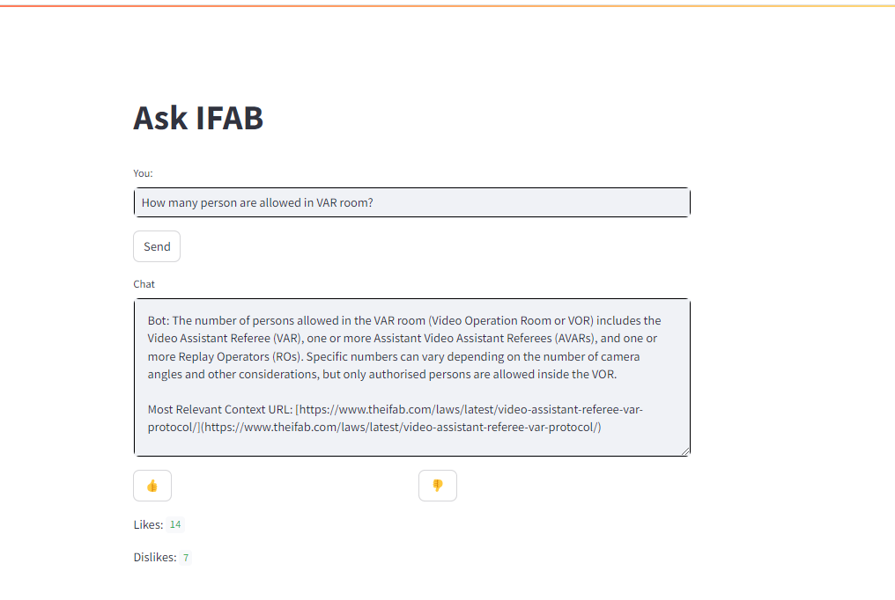
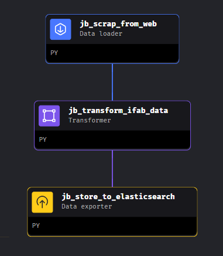
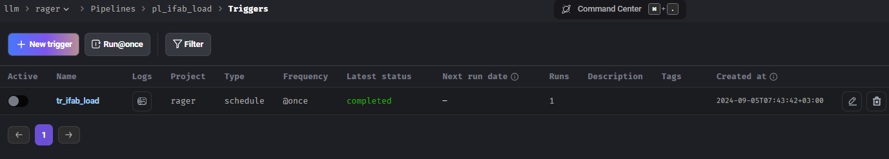
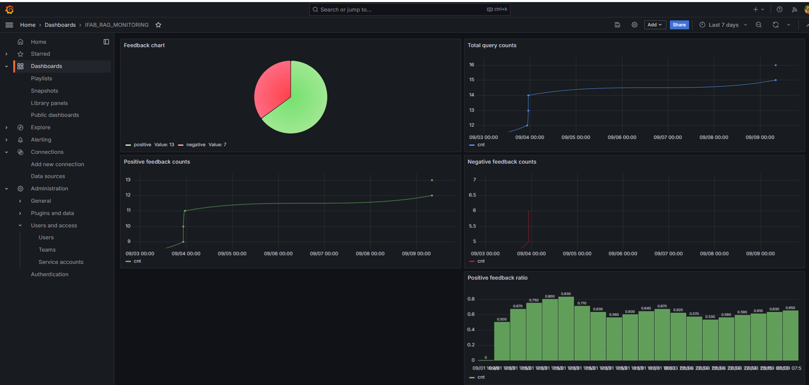
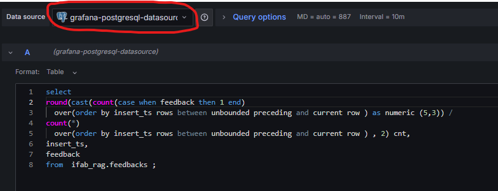

# IFAB Football Rules Chatbot Application README

## 1. Problem Description
Football (soccer) is the most popular sport game in the world, but its rules might be confusing even for true football experts. Moreover, football rules are constantly evolving. If you have a tricky question regarding it, The IFAB Football Rules Chatbot is designed to answer inquiries related to the rules of football, leveraging the authoritative source from The International Football Association Board (IFAB) available at [https://www.theifab.com/](https://www.theifab.com/). IFAB is recognized globally for establishing and amending the laws that govern the game of football.

## 2. RAG Flow
The application employs the Retrieve-and-Generate (RAG) pattern to fetch and process data:

- **Data Retrieval**: The app scrapes content from IFAB's website, segments the text into manageable pieces, and computes embeddings using the Sentence-Transformers library with the `all-mpnet-base-v2` model.
  
- **Data Storage**: After processing, the information is stored in Elasticsearch for efficient retrieval.

- **Question Answering**: Upon receiving a user query, the app fetches relevant documents from Elasticsearch, creates a context-based prompt combining user's question and retrieved content, and forwards this prompt to OpenAI's GPT-4o model for generating an informative and context-aware response.

  Source Code: `ifab_qna_rag/ifab_chatbot_app/rag.py`

  

## 3. Retrieval Evaluation
For retrieval of context two approaches were considered and evalueated:
- **Text Search**
- **Vector Search**: Outperformed text search using metrics such as MRR (Mean Reciprocal Rank) and Hit-rate, making it the chosen method for retrieving relevant documents.
 

## 4. Interface
Developed using Streamlit, the interface offers a user-friendly experience with functionality to like/dislike responses, aiding in gathering user feedback. 
  
  Access the application via: [http://localhost:8501/](http://localhost:8501/)
  
  

  Collected feedback data is stored in a PostgreSQL database with two main tables:
- `qna`: Stores all the queries asked by users.
- `feedbacks`: Records user feedbacks.

## 5. Ingestion Pipeline
Utilizing Mage Orchestrator. Pipeline consists of 3 jobs
- **Data Scraping**: Job `jb_scrap_from_web` retrieves and parses data from the IFAB website.
- **Data Transformation**: Job `jb_transform_ifab_data` cleans and prepares the data including vector embeddings.
- **Data Storage**: Job `jb_store_to_elasticsearch` saves data into the respective Elasticsearch index.
  
  


  Trigger via `tr_ifab_load`.


  

Access Mage at: [http://localhost:6789/](http://localhost:6789/)  
Source Code: `ifab_qna_rag/mage/llm/rager`

## 6. Monitoring
Feedback and usage metrics are monitored through a Grafana dashboard available at [http://localhost:3000/](http://localhost:3000/):
- **Feedback chart**
- **Total query counts**
- **Negative feedback counts**
- **Positive feedback counts**
- **Positive feedback ratio**: Insightful for evaluating user satisfaction over time.



## 7. Containerization
Docker-compose is used to manage all application components, with services including Mage, PostgreSQL, Elasticsearch, Grafana, and the IFAB Chatbot App itself. Configuration is handled using `ifab_qna_rag/docker-compose.yml`.


## 8. Deployment
### 8.1. Prerequisites:
- Docker (including Docker Compose).
- Since current version of application uses Gpt4-o model hosted by OpenAI, set the OpenAI API Key in the environment variables:
  ```
  export OPENAI_API_KEY="<API_KEY_VALUE>"
  ```

### 8.2. Build and Run:
Navigate to the root directory and execute:
```
cd ifab_qna_rag
docker-compose build
docker-compose up
```

This will run all described above services and aplication itself. 

### 8.3. Import Grafana Dashboards:
Import pre-created dashboards from:
`ifab_qna_rag/grafana/exports/IFAB_RAG_MONITORING.json`
For panels that show no data, adjust by re-selecting the data source for the panel (please save the SQL query in advance,since it could be deleted).


